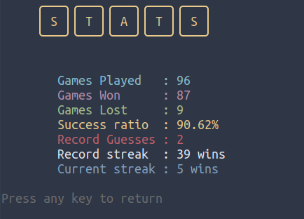

# Wordy

**Wordy** is a word spelling puzzle.

You have **6 guesses** to find out the **secret 5-letter word**.


---


If a letter appears **green**, that means that this letter **exists in the secret word, and is in the right position**.


If a letter appears **yellow**, that means that this letter **exists in the secret word, but is in NOT the right position**.


If a letter appears **red**, that means that this letter **does NOT appear in the secret word AT ALL**.


As mentioned above, there are **6 guesses** to find the secret word.


---

### Dependencies

* As mentioned above, this script is using the word list contained in `/usr/share/dict/words`.

  If your distro doesn't include this installed, you can install the respective package (`wordlist`, `words`) using the respective command (`apt`, `pacman`).

* Another, much less important dependency is [lolcat](https://github.com/busyloop/lolcat).

 `lolcat` helps show the *Statistics* in **color**, and therefore more fun.

 

 To install `lolcat`

  * Debian based:

    ```
    sudo apt install lolcat
    ```

 * Arch based:

    ```
    sudo pacman -S lolcat
    ```

 * CentOS, RHEL, Fedora:

    ```
    sudo dnf install lolcat
    ```


### Install

```
git clone https://gitlab.com/christosangel/wordy.git

cd wordy/

```

To run the script from any directory, it has to be made executable, and then copied to `$PATH`:

```

chmod +x wordy.sh

cp wordy.sh ~/.local/bin/

```

After that, the user must run this command in order to create the necessary directories and files:

```
mkdir ~/.cache/wordy/

cp statistics.txt wordy.png ~/.cache/wordy/

```

### Run

Just run:

```
wordy.sh
```

There is another project that might interest you:

[https://gitlab.com/christosangel/wordle-solver](https://gitlab.com/christosangel/wordle-solver)


***Have fun!***
