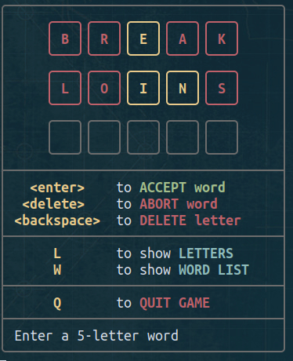
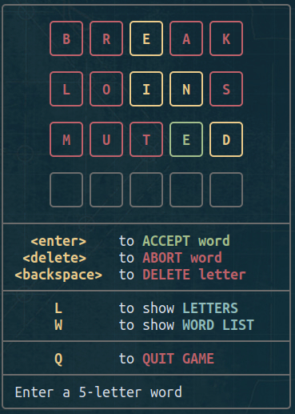
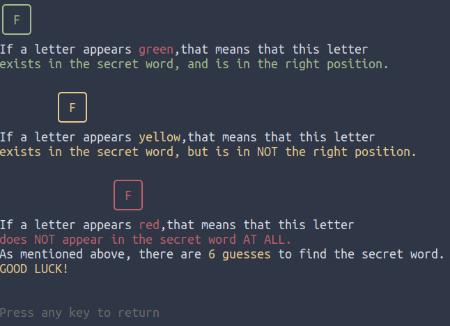

# Wordy

**Wordy** is a word spelling puzzle.

You have **6 guesses** to find out the **secret 5-letter word**.

{width=400}

---
- If a letter appears **green**, that means that this letter **exists in the secret word, and is in the right position**.

- If a letter appears **yellow**, that means that this letter **exists in the secret word, but is in NOT the right position**.

- If a letter appears **red**, that means that this letter **does NOT appear in the secret word AT ALL**.

{width=40}
{width=40}
{width=35}

---

As mentioned above, there are **6 guesses** to find the secret word.

{width=400}

{width=400}

{width=400}

{width=400}


---

## Usage

Through the main menu, the player can

- Start a new game

{width=400}

- Read the game rules

{width=400}

- Check Game Statistics

{width=400}

- Configure Game

{width=400}

- Exit Wordy

{width=150}

---
While playing, the user can also check out:

- The letters that have been used

{width=400}

- The entire word list

{width=400}

---

## Dependencies

* This script is using the word list contained in `/usr/share/dict/words`.

  If your distro doesn't include this installed, you can install the respective package (`wordlist`, `words`) using the respective command (`apt`, `pacman`).

* **ADDITIONALLY**, if someone wishes to play the game using a different word list, they can do so, through configuring the game.

## Configuring

Either within the game (option `4` of main menu) or just by editing `$HOME/.local/share/wordy/wordy.config` file, the user can configure these two parameters:

|n|Variable|Explanation| Acceptable Values|Default Value|
|---|---|---|---|---|
|_1_| DICTIONARY|The dictionary used in this game|Absolute path of an adequate `txt` file|`/usr/share/dict/words`|
|_2_|PREFERRED_EDITOR |Editor to be used to open the config file|Any gui or tui text editor|`nano`|


## Install

From a terminal window, clone the repository and change directory to `wordy/`

```
git clone https://gitlab.com/christosangel/wordy.git&&cd wordy/
```

To run the script from any directory, it has to be made executable, and then copied to `$PATH`:

```
chmod +x install.sh&&./install.sh
```


### Run

Just run:

```
wordy.sh
```
or from the same directory:

```
wordy.sh
```

This TUI game was inspired by [wordle](https://www.nytimes.com/games/wordle/index.html)

There is another project that might interest you:

[https://gitlab.com/christosangel/wordle-solver](https://gitlab.com/christosangel/wordle-solver)


***Have fun!***
